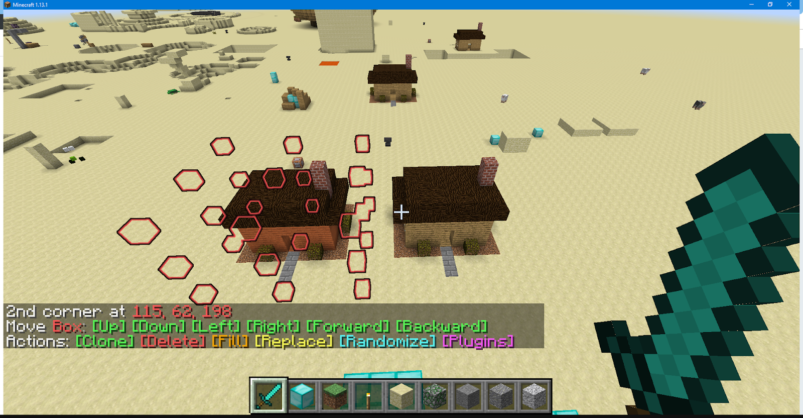

Welcome to BlingEdit's documentation!
=====================================



```eval_rst
.. toctree::
   :maxdepth: 2

   getting_started
   selecting
   operations
   plugin
   changelog
```

BlingEdit is a datapack for Minecraft 1.13 which gives you a bunch of world editing tools, inspired by MCEdit and WorldEdit.
